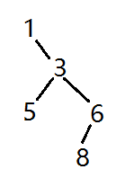

# 重建二叉树  

输入某二叉树的前序遍历和中序遍历的结果，请重建出该二叉树。假设输入的前序遍历和中序遍历的结果中都不含重复的数字。例如输入前序遍历序列{1,2,4,7,3,5,6,8}和中序遍历序列{4,7,2,1,5,3,8,6}，则重建二叉树并返回。

## 分析


详细分析：

- 前序遍历：1,2,4,7,3,5,6,8  
- 前序遍历特点是：根左右，那么根是1,  
- 中序遍历；4,7,2,1,5,3,8,6，特点是：左根右，那么，根节点1的左子树为：4,7,2  
- 根节点1的右子树为：5,3,8,6  
- 左子树的4,7,2，在前序遍历中，第一个是2，那么根是2，再对应中序中2左边为4,7，右边没有，那么2为根的节点中，4和7是左子树的节点，2没有右子树；前序中，4在前7后，4为7的根，中序中，4的左边为空，右边为7，即7为4的右子树：


- 可确定3为1的右子树，以3为根，左子树5，右子树8,6；  
- 右子树8,6，前序6在前，6为8的根，中序6在8右侧，6为8的右子树。



左右子树综合一下，就是下面这样：


## 递归

### 递归1

```cpp
/**
 * Definition for binary tree
 * struct TreeNode {
 *     int val;
 *     TreeNode *left;
 *     TreeNode *right;
 *     TreeNode(int x) : val(x), left(NULL), right(NULL) {}
 * };
 */
class Solution {
public:
    TreeNode* reConstructBinaryTree(vector<int> pre,vector<int> vin) {
        if(pre.empty() || vin.empty() || pre.size()!=vin.size())
            return NULL;
        TreeNode* root = new TreeNode(pre[0]);
        helper(root, pre, vin);
        return root;
    }
    void helper(TreeNode *root, vector<int> pre, vector<int> vin)
    {
        if(pre.empty() && vin.empty())
            return;
        vector<int> pre_left, pre_right;
        vector<int> vin_left, vin_right;
        bool root_found = false;
        for(int eidx=0; eidx<vin.size(); eidx++)
        {
            if(root->val==vin[eidx])
                root_found = true;
            else if(!root_found)
                vin_left.push_back(vin[eidx]);
            else
                vin_right.push_back(vin[eidx]);
        }
        for(int eidx=1; eidx<pre.size(); eidx++)
        {
            int counter = count(vin_left.begin(), vin_left.end(), pre[eidx]);
            if(counter)
                pre_left.push_back(pre[eidx]);
            else
                pre_right.push_back(pre[eidx]);
        }
        if(pre_left.size()>=1)
        {
            root->left = new TreeNode(pre_left[0]);
            helper(root->left, pre_left, vin_left);
        }
        if(pre_right.size()>=1)
        {
            root->right = new TreeNode(pre_right[0]);
            helper(root->right, pre_right, vin_right);
        }
        return;
    }
};
```

### 递归2  

- 链接：https://www.nowcoder.com/questionTerminal/8a19cbe657394eeaac2f6ea9b0f6fcf6  
- 来源：牛客网 

```cpp
/**
 * Definition for binary tree
 * struct TreeNode {
 *     int val;
 *     TreeNode *left;
 *     TreeNode *right;
 *     TreeNode(int x) : val(x), left(NULL), right(NULL) {}
 * };
 */
class Solution {
public:
    TreeNode* reConstructBinaryTree(vector<int> pre,vector<int> vin) {
        if(pre.empty() || vin.empty() || pre.size()!=vin.size())
            return NULL;
        TreeNode *root = helper(pre, 0, pre.size()-1, vin, 0, vin.size()-1);
        return root;
    }
    TreeNode* helper(vector<int> &pre, int pre_start_idx, int pre_end_idx, 
                     vector<int> &vin, int vin_start_idx, int vin_end_idx)
    {
        if(pre_start_idx>pre_end_idx || vin_start_idx>vin_end_idx)
            return NULL;
        TreeNode *root = new TreeNode(pre[pre_start_idx]);
        
        for(int eidx=vin_start_idx; eidx<=vin_end_idx; eidx++)
        {
            if(vin[eidx]==pre[pre_start_idx])
            {
                // 注意边界条件
                int new_pre_left_end_idx = pre_start_idx + eidx - vin_start_idx;//startPre+i-startIn;
                int new_pre_right_start_idx = eidx - vin_start_idx + pre_start_idx + 1;//i-startIn+startPre+1;
                root->left = helper(pre, pre_start_idx+1, new_pre_left_end_idx,
                                    vin, vin_start_idx, eidx-1);
                root->right = helper(pre, new_pre_right_start_idx, pre_end_idx,
                                     vin, eidx+1, vin_end_idx);
                break;
            }
        }
        return root;
    }
};
```


## 非递归


