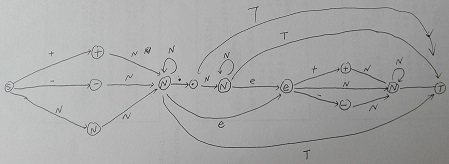

# 表示数值的字符串

- 请实现一个函数用来判断字符串是否表示数值（包括整数和小数）。  
- 例如，字符串`"+100"`,`"5e2"`,`"-123"`,`"3.1416"`和`"-1E-16"`都表示数值。  
- 但是`"12e"`,`"1a3.14"`,`"1.2.3"`,`"+-5"`和`"12e+4.3"`都不是。

## 逐字符遍历

### 逐字符遍历1

```cpp
class Solution {
public:
    bool isNumeric(char* str)
    {// 标记符号、小数点、e是否出现过
        bool decimal = false, hasE = false, sign = false;
        for(int i=0; i<strlen(str); i++) {
            if(str[i]=='E' || str[i]=='e') {
                // e不能出现在起始和结尾，也不会出现两次
                if(i==0 || i==strlen(str)-1 || hasE) return false;
                hasE = true;
            }
            else if(str[i]=='+' || str[i]=='-') {
                // 第一次出现,若idx>0，且!='e','E',则必须在E/e后
                if(!sign && i>0 && str[i-1]!='e' && str[i-1]!='E') return false;
                // 第二次出现则必须位于e之后
                if(sign && str[i-1]!='e' && str[i-1]!='E') return false;
                sign = true;
            }
            else if(str[i]=='.') {
                // e后面不能接小数点，小数点不能出现两次
                if(i==0 || hasE || decimal) return false;
                decimal = true;
            }
            else if(str[i]<'0' || '9'<str[i]) {
                return false;
            }
        }
        return true;
    }
};
```

### 逐字符遍历2

1. +,-  
    1.1 整数开始部分遇到+、-号跳过  
2. 小数点  
    2.1 只能出现一次  
    2.2 小数点之前不能存在e  
3. e  
    3.1 e之前必须有整数  
    3.2 e只能出现一次  
    3.3 e之后可存在+、-号，但+-之后必须有整数  
  
```cpp
class Solution {
public:
    bool isNumeric(char* str) {
        if(str==NULL || *str=='\0') return false;
        if(*str=='+' || *str=='-') ++str;
        bool hasNum = false;
        bool hasDot = false;
        bool hasE = false;
        while(*str != '\0') {
            if(*str>='0' && *str<='9') { //标记整数部分的状态
                ++str;
                hasNum = true;
            }
            else if(*str == '.') { //小数点只能出现1次，e后无小数点
                if(hasDot || hasE) return false;
                ++str;
                hasDot = true;
            }
            else if(*str=='e' || *str=='E') { //e前没有整数或e已经出现过，则返回false
                if(!hasNum || hasE) return false;
                ++str;
                hasE = true;
                //e之后可以出现+-号再加整数
                if(*str=='+' || *str=='-') ++str;
                if(*str=='\0') return false;
            }
            else return false;
        }
        return true;
    }
};
```

## 正则表达式

```cpp
#include <regex>
class Solution {
public:
    bool isNumeric(char* string)
    {
        regex reg("[\\+\\-]?\\d*(\\.\\d+)?([eE][\\+\\-]?\\d+)?");
        return regex_match(string, reg);
    }
};
```

以下对正则进行解释:

```
[\\+\\-]?            -> 正或负符号出现与否
\\d*                 -> 整数部分是否出现，如-.34 或 +3.34均符合
(\\.\\d+)?           -> 如果出现小数点，那么小数点后面必须有数字；
                        否则一起不出现
([eE][\\+\\-]?\\d+)? -> 如果存在指数部分，那么e或E肯定出现，+或-可以不出现，
                        紧接着必须跟着整数；或者整个部分都不出现
```
补充：
```
+ 号代表前面的字符必须至少出现一次（1次或多次）。
* 号代表字符可以不出现，也可以出现一次或者多次（0次、或1次、或多次）。
? 问号代表前面的字符最多只可以出现一次（0次、或1次）

*、+限定符都是贪婪的，因为它们会尽可能多的匹配文字，只有在它们的后面加上一个?就可以实现非贪婪或最小匹配。
如匹配尖括号，/<.*>/为贪婪匹配，/<.*?>/为非贪婪匹配

^ 指的是匹配字符串开始的位置
[^指定字符串] 指的是除指定字符串以外的其他字符串

参考：正则表达式 – 语法 | 菜鸟教程
http://www.runoob.com/regexp/regexp-syntax.html
```

## 自动机

### 自动机1



```cpp
class Solution {
public:
    bool isNumeric(char* string)
    {
        int i = 0;
        if(string[i]=='+' || string[i]=='-' || IsNum(string[i])){
            while(string[++i]!='\0' && IsNum(string[i]));
            if(string[i]=='.'){
                if(IsNum(string[++i])){
                    while(string[++i]!='\0' && IsNum(string[i]));
                    if(string[i]=='e'||string[i]=='E'){
                        i++;
                        if(string[i]=='+' || string[i]=='-' || IsNum(string[i])){
                            while(string[++i]!='\0' && IsNum(string[i]));
                            if(string[i]=='\0') return true;
                            else return false;
                        }else return false;
                    }else if(string[i]=='\0') return true;
                    else return false;
                }else if(string[++i]=='\0') return true;
                else return false;
            }else if(string[i]=='e'||string[i]=='E'){
                i++;
                if(string[i]=='+' || string[i]=='-' || IsNum(string[i])){
                    while(string[++i]!='\0' && IsNum(string[i]));
                    if(string[i]=='\0') return true;
                    else return false;
                }else return false;
            }else if(string[i]=='\0') return true;
            else return false;           
        }else return false;
    }
     
    bool IsNum(char ch)
    {
        if(ch<'0'||ch>'9') return false;
        else return true;
    }
};
```

### 自动机2

```cpp
class Solution {
public:
    char arr[10] = "+-n.ne+-n";
    int turn[10][9] = {
       //+  -  n  .  n  e  +  -  n
        {1, 1, 1, 0, 0, 0, 0, 0, 0},    // # start
        {0, 0, 1, 1, 0, 0, 0, 0, 0},    // +
        {0, 0, 1, 1, 0, 0, 0, 0, 0},    // -
        {0, 0, 1, 1, 0, 1, 0, 0, 0},    // n
        {0, 0, 0, 0, 1, 0, 0, 0, 0},    // .
        {0, 0, 0, 0, 1, 1, 0, 0, 0},    // n
        {0, 0, 0, 0, 0, 0, 1, 1, 1},    // e
        {0, 0, 0, 0, 0, 0, 0, 0, 1},    // +
        {0, 0, 0, 0, 0, 0, 0, 0, 1},    // -
        {0, 0, 0, 0, 0, 0, 0, 0, 1}     // n
    };
    bool isNumeric(char* string) {
        int cur = 0;
        for(int j, i = 0; string[i]; i++) {
            for(j = 0; j < 9; j++) {
                if(turn[cur][j]) {
                    if(('0' <= string[i] && string[i] <= '9' && arr[j] == 'n') ||
                        (string[i] == 'E' && arr[j] == 'e')||
                        string[i] == arr[j]) {
                        cur = j + 1;
                        break;
                    }
                }
            }
            if(j == 9) return false;
        }
        if(cur == 3 || cur == 4 || cur == 5 || cur == 9)
           return true;
        return false;
    }
};
```

### 自动机3


```cpp
class Solution {
private:
    enum STATUS{ END = 0, START, SIGNED1, INTEGER, POINT, FLOAT, EXPONENT, SIGNED2, SCIENCE };
    STATUS dfa[256][9] = { END };
public:  
    Solution(){
        for (int i = 0; i < 256; ++i)
        {
            for (int j = 0; j < 9; ++j)
            {
                dfa[i][j] = END;
            }
        }
        initDFA();
    }
    bool isNumeric(char* string)
    {
        STATUS current = START;
        while (*string && current != END)
        {
            current = DFA(current, *string);
            ++string;
        }
        switch (current)
        {
        case INTEGER:
        case FLOAT:
        case SCIENCE:
            return true;
        }
        return false;
    }
private:
    void initDFA(){
        char d = '0';
        // 1. START 变迁
        dfa['+'][START] = SIGNED1;
        dfa['-'][START] = SIGNED1;
        dfa['.'][START] = POINT;
        for (d = '0'; d <= '9'; ++d)
        {
            dfa[d][START] = INTEGER;
        }
 
        // 2. SIGNED1 变迁
        for (d = '0'; d <= '9'; ++d)
        {
            dfa[d][SIGNED1] = INTEGER;
        }
        dfa['.'][SIGNED1] = POINT;
 
        // 3. INTEGER 变迁
        for (d = '0'; d <= '9'; ++d)
        {
            dfa[d][INTEGER] = INTEGER;
        }
        dfa['.'][INTEGER] = FLOAT;
        dfa['E'][INTEGER] = EXPONENT;
        dfa['e'][INTEGER] = EXPONENT;
 
        // 4. POINT 变迁
        for (d = '0'; d <= '9'; ++d)
        {
            dfa[d][POINT] = FLOAT;
        }
 
        // 5. FLOAT 变迁
        for (d = '0'; d <= '9'; ++d)
        {
            dfa[d][FLOAT] = FLOAT;
        }
        dfa['E'][FLOAT] = EXPONENT;
        dfa['e'][FLOAT] = EXPONENT;
 
        // 6. EXPONENT 变迁
        for (d = '0'; d <= '9'; ++d)
        {
            dfa[d][EXPONENT] = SCIENCE;
        }
        dfa['+'][EXPONENT] = SIGNED2;
        dfa['-'][EXPONENT] = SIGNED2;
 
        // 7. SIGNED2 变迁
        for (d = '0'; d <= '9'; ++d)
        {
            dfa[d][SIGNED2] = SCIENCE;
        }
 
        // 8. SCIENCE 变迁
        for (d = '0'; d <= '9'; ++d)
        {
            dfa[d][SCIENCE] = SCIENCE;
        }
 
        // 其余情况均变迁到  END

    }

    STATUS DFA(STATUS current, char input)
    {
        STATUS ret = START;
        return dfa[input][current];
    }
};
```
