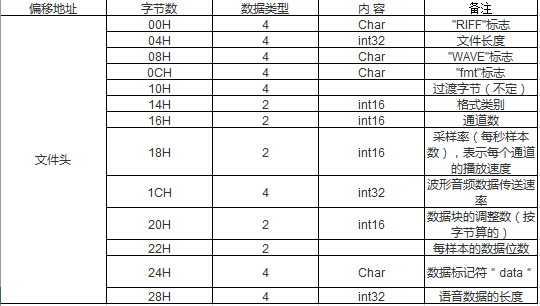

# C/C++面试常考知识点

来源：牛客网

## 1.代码分析

分析下面代码有什么问题？

```cpp
void test1()
{
    char string[10];
    char* str1 = "0123456789";
    strcpy( string, str1 );
}
```

字符串str1需要11个字节才能存放下（包括末尾的’\0’），而string只有10个字节的空间，strcpy会导致数组越界。

## 2.代码分析

分析下面代码有什么问题？

```cpp
void test2()
{
    char string[10], str1[10];
    int i;
    for(i=0; i<10; i++)
    {
        str1  = 'a';
    }
    strcpy( string, str1 );
}
```

1.不能通过编译。因为数组名str1为 `char *const` 类型的右值类型，根本不能赋值；  
2.即使想对数组的第一个元素赋值，也要使用 `*str1 = 'a'`;   
3.对字符数组赋值后，使用库函数strcpy进行拷贝操作，strcpy会从源地址一直往后拷贝，直到遇到'\0'为止。所以拷贝的长度是不定的。如果一直没有遇到'\0'导致越界访问非法内存，程序就崩了。

完美修改方案为：

```cpp
void test2()
{
    char string[10], str1[10];
    int i;
    for(i=0; i<9; i++)
    {
        str1[i] = 'a';
    }
    str1[9] = '\0';
    strcpy( string, str1 );
}
```

## 3.代码分析

指出下面代码有什么问题？

```cpp
void test3(char* str1)
{
    if(str1 == NULL) {
        return ;
    }
    char string[10];
    if( strlen( str1 ) <= 10 )
    {
        strcpy( string, str1 );
    }
}
```

知识点：  
- `strlen(p)`：返回字符指针 p 的长度（不计`\0`在内），是C语言风的格字符串函数；  
- `strcpy`：从源地址开始拷贝，直到遇到`\0`为止；
- `sizeof`和`strlen`的区别：`sizeof`的计算包含换行符，`strlen`不包括换行符，所以要小于10，就一个字节的余量。  

问题：  
- 将 str1 拷贝到 string ， string 长度为10，str1长度最多为10（含`\0`），而`strlen`不计`\0`，所以计算 str1 是否装满了，是与 9 比较（排除掉`\0`），而不是 10 。

解决：  
- `if( strlen( str1 ) <= 10 )` 改为 `<10`。

## 4.写出完整版的strcpy函数

如果编写一个标准strcpy函数的总分值为10，下面给出几个不同得分的答案： 

2分 
```cpp
void strcpy( char *strDest, char *strSrc )
{
    while( (*strDest++ = * strSrc++) != '\0' );
}
```

4分 
```cpp
void strcpy( char *strDest, const char *strSrc ) 
//将源字符串加const，表明其为输入参数，加2分
{
    while( (*strDest++ = * strSrc++) != '\0' );
}
```

7分 
```cpp
void strcpy(char *strDest, const char *strSrc) 
{
    //对源地址和目的地址加非0断言，加3分
    assert( (strDest != NULL) && (strSrc != NULL) );
    while( (*strDest++ = * strSrc++) != '\0' );
}
```

10分 
```cpp
//为了实现链式操作，将目的地址返回，加3分！ 
char * strcpy( char *strDest, const char *strSrc ) 
{
    assert( (strDest != NULL) && (strSrc != NULL) );
    char *address = strDest; 
    while( (*strDest++ = * strSrc++) != '\0' ); 
    return address;
}
```

## 5.代码分析

检查下面代码有什么问题？

```cpp
void GetMemory( char *p )
{
    p = (char *) malloc( 100 );
}
void Test( void ) 
{
    char *str = NULL;
    GetMemory( str ); 
    strcpy( str, "hello world" );
    printf( str );
}
```

- 要改变一个变量的值，要传地址，例如你改变`int a`的值，你传`&a`，改变`int *a` 你就指针的地址，也就是二级指针；
- 如若成功申请内存，最后在主函数中需要`free`掉。

解决：

```cpp
//传值调用
void GetMemory( char **p )
{
    *p = (char *) malloc( 100 );
}
//引用调用
void GetMemory_1(char *&p)
{
    p = (char *) malloc (100);
}
```

## 6.代码分析

检查下面代码有什么问题？

```cpp
char *GetMemory( void )
{ 
    char p[] = "hello world"; 
    return p; 
}
void Test( void )
{ 
    char *str = NULL; 
    str = GetMemory(); 
    printf( str ); 
}
```

- `char p[]="hello world";`相当于`char p[12]，strcpy(p," hello world" )`；
- `p`是一个数组名，属于局部变量，存储在栈中；
- `"hello world"` 存储在内存四区的data区的ro段，但是指向这一地址的数组`p`存储的是位于栈区，当函数结束，包括`p`在内的栈区变量被回收，因而函数返回的`p`也被销毁，此时`p`的值不确定，其指向的内容也变得不确定。虽然我们知道data区ro段的 `" hello world"` 未改变，`p`也找不到了。

解决：  
- 方法1：`char *p = "hello world"; return p;`，这里 `p` 直接指向文字存储区的 `" hello world"` ，函数按值返回`p`存储的地址，所以有效；   
- 方法2：`static char p[]= " hello world" ; return p;`，`static` 指出数组 `p` 为静态数组存储在内存的data区，函数结束也不会释放，所以有效。

## 7.代码分析

检查下面代码有什么问题？

```cpp
void GetMemory( char **p, int num )
{
    *p = (char *) malloc( num );
}
void Test( void )
{
    char *str = NULL;
    GetMemory( &str, 100 );
    strcpy( str, "hello" ); 
    printf( str ); 
}
```

存在的问题：

1. 没有`malloc`申请失败的判断；  
2. `printf`的使用错误；  
3. `malloc`的堆内存没有释放（`free`并重置为`NULL`）。

改后：

```cpp
void GetMemory( char **p, int num )
{
    if(num <= 0) {
        printf("error: num <= 0\n");
        return;
    }
    *p = (char *) malloc( num );
    if(*p == NULL) {
        printf("error: p failed to malloc\n");
        return;
    }
}
void Test( void )
{
    char *str = NULL;
    GetMemory( &str, 100 );
    strcpy( str, "hello" ); 
    printf( "%s\n", str );
    free(str);
    str = NULL;
}
```

## 8.代码分析

检查下面代码有什么问题？

```cpp
void Test( void )
{
    char *str = (char *) malloc( 100 );
    strcpy( str, "hello" );
    free( str ); 
    //省略的其它语句
}
```

1. `malloc`申请的空间，没有检查申请是否成功的判断；
2. `free`之后没有重置为`NULL`，可能造成野指针。

修改后代码：

```cpp
void Test( void )
{
    char *str = (char *) malloc( 100 );
    if(str == NULL) {
        printf("error: fail to malloc\n");
        return;
    }
    strcpy( str, "hello" );
    free( str ); 
    str = NULL;
    //省略的其它语句
}
```

## 9.代码分析

检查下面代码有什么问题？

```cpp
swap( int* p1, int* p2 )
{
    int *p;
    *p = *p1;
    *p1 = *p2;
    *p2 = *p;
}
```

1. 没有返回值类型；  
2. `int *p`是一个野指针，其指向有可能是系统或者当前正在使用的内存，如若需要使用指针需要`malloc`重新开辟，最后不要忘记`free`释放并重置为`NULL`。

修改后代码：

```cpp
// 使用指针
void swap( int* p1, int* p2 )
{
    int *p = (int*)malloc(sizeof int);
    if(p==NULL) {
        printf("fail to malloc\n");
        return;
    }
    *p = *p1;
    *p1 = *p2;
    *p2 = *p;
    free(p);
    p = NULL;
}
```

```cpp
// 使用临时变量
void swap( int* p1, int* p2 )
{
    int tmp = *p1;
    *p1 = *p2;
    *p2 = tmp;
}
```

```cpp
// 使用引用
void swap( int& v1, int& v2 )
{
    int tmp = v1;
    v1 = v2;
    v2 = tmp;
}
```

- 若使用指针的引用，注意符号的位置，声明的方法为：`int *& p1`；  
- 更短参见：C++ Primer 第五版，2.3.2指针。  

## 10.问答题

分别给出BOOL，int，float，指针变量 与“零值”比较的 if 语句（假设变量名为var）

```cpp
// bool
if(!var) printf("false\n");

// int
if(var == 0) printf("0\n");

// float
const float eps = 1e-5;
if(abs(var) <= eps) printf("0.0\n");

// pointer
if(var==nullptr) printf("nullptr\n");
if(!var) printf("nullptr\n");
```

## 11.问答题

以下为Windows NT下的32位C++程序，请计算sizeof的值

```cpp
void Func(char str[100])
{
    sizeof(str) = ? //是多少
}

void *p = malloc( 100 );
sizeof p = ? //是多少
```

答案：  
- sizeof(str) = 4   
- sizeof(p) = 4   

- `Func(char str[100])`**函数中数组名作为函数形参时，在函数体内，数组名失去了本身的内涵，仅仅只是一个指针**；
- 在失去其内涵的同时，它还失去了其常量特性，因而可以作自增、自减等操作，可以被修改。   

数组名的本质如下：   

1. **数组名指代一种数据结构，这种数据结构就是数组**。如`char str[10]; cout << sizeof(str) << endl;`，其输出结果为10，str指代数据结构`char[10]`；   
2. **数组名可以转换为指向其指代实体的指针，而且是一个指针常量，不能作自增、自减等操作，不能被修改。如`char str[10]; str++;`，编译出错，提示str不是左值**；    
3. **数组名作为函数形参时，沦为普通指针**。

Windows NT 32位平台下，指针的长度（占用内存的大小）为4字节，故`sizeof(str)` 、`sizeof(p)`都为4。  

## 12.问答题

写一个“标准”宏MIN，这个宏输入两个参数并返回较小的一个。另外，当你写下面的代码时会发生什么事？   

`least = MIN(*p++, b);`

下面是标准的MIN宏写法：

```c
#define MIN(A,B) ((A) <= (B) ? (A) : (B))   
```

`MIN(*p++, b)`会产生宏的副作用。

- 宏定义可以实现类似于函数的功能，但是它终归不是函数，而宏定义中括弧中的“参数”也不是真的参数，在宏展开的时候对“参数”进行的是一对一的替换。   

对宏定义的使用要非常小心，特别要注意两个问题：   

1. 谨慎地将宏定义中的“参数”和整个宏用用括弧括起来。所以，严格地讲，下述解答都是错误的（考虑`3*MIN(a, b)`这种情况）：   

```cpp
#define MIN(A,B) (A) <= (B) ? (A) : (B)
#define MIN(A,B) (A <= B ? A : B )
```

2. 防止宏的副作用     

宏定义`#define MIN(A,B) ((A) <= (B) ? (A) : (B))`对`MIN(*p++, b)`的作用结果是：

`((*p++) <= (b) ? (*p++) : (b))`

这个表达式会产生副作用，指针p当判断为真时，会作2次++自增操作，否则1次。**宏中参数不能有自加等操作。**

除此之外，另一个应该判0分的解答是：   

`#define MIN(A,B) ((A) <= (B) ? (A) : (B));`

对宏的定义不能加分号是因为宏定义只是用宏名对一个字符串进行简单的替换，如果在宏定义命令后加了分号，将会连同分号一起进行置换。


## 13.问答题

为什么标准头文件都有类似以下的结构？

```cpp
#ifndef __INCvxWorksh
#define __INCvxWorksh 
#ifdef __cplusplus
extern "C" {
#endif 
/*...*/ 
#ifdef __cplusplus
}
#endif 
#endif /* __INCvxWorksh */
```

头文件中的编译宏的作用是防止被重复引用     

```cpp
#ifndef　__INCvxWorksh
#define　__INCvxWorksh
#endif 
```

- 作为一种面向对象的语言，C++支持函数重载，而过程式语言C则不支持。函数被C++编译后在symbol库中的名字与C语言的不同。例如，假设某个函数的原型为： `void foo(int x, int y);`   
- 该函数被C编译器编译后在symbol库中的名字为_foo，而C++编译器则会产生像_foo_int_int之类的名字。_foo_int_int这样的名字包含了函数名和函数参数数量及类型信息，C++就是靠这种机制来实现函数重载的。   
为了实现C和C++的混合编程，C++提供了C连接交换指定符号extern "C"来解决名字匹配问题，函数声明前加上extern "C"后，则编译器就会按照C语言的方式将该函数编译为_foo，这样C++语言中就可以调用C函数了。  

## 14.编程题

编写一个函数，作用是把一个`char`组成的字符串循环右移`n`个。比如原来是“abcdefghi”如果`n = 2`，移位后应该是“hiabcdefg” 函数头是这样的：  
- `pStr`是指向以'\0'结尾的字符串的指针  
- `steps` 是要求移动的`n`  

```cpp
void LoopMove ( char * pStr, int steps )
{
    //请填充...
}
```

```cpp
void LoopMove(char *pStr, int steps) {
    if(!pStr || steps<0) return;
    int len = strlen(pStr);
    int n = steps % len;
    char tmp[128];
    memcpy(tmp, pStr+len-n, n);
    memcpy(tmp+n, pStr, len-n);
    memcpy(pStr, tmp, len);
}
```

当然这种写法中的128不好看，可以改为这样：

```cpp
void LoopMove(char *pStr, int steps) {
    if(!pStr || steps<0) return;
    int len = strlen(pStr);
    int st = steps % len;
    char *tmp = (char*)calloc(len + 1, sizeof char);
    if(!tmp) {
        printf("fail to malloc\n");
        return;
    }
    
    memcpy(tmp, pStr+len-st, st);
    memcpy(tmp+n, pStr, len-st);
    memcpy(pStr, tmp, len);
    // 需要 pStr[len] = '\0'; 这句嘛
    // 或者，如果返回tmp为结果，有必要做 tmp[len] = '\0' 这句嘛
    
    if(tmp) free(tmp);
    tmp = NULL; // C指针写法
}
```

- 参考：[C 库函数 – memcpy() | 菜鸟教程](http://www.runoob.com/cprogramming/c-function-memcpy.html)


或者用`strcpy`:

```cpp
void LoopMove(char *pStr, int steps) {
    if(!pStr || steps<0) return;
    int len = strlen(pStr);
    int st = steps % len;
    char *tmp = (char*)calloc(len+1, sizeof char);
    if(!tmp) {
        printf("fail to malloc\n");
        return;
    }

    strcpy(tmp, str+len-st);
    strcpy(tmp+st, str);
    *(tmp+len) = '/0';
    strcpy(str, tmp);
    
    if(tmp) free(tmp);
    tmp = NULL; // C指针写法
}
```

## 15.问答题

已知WAV文件格式如下表，打开一个WAV文件，以适当的数据结构组织WAV文件头并解析WAV格式的各项信息。

WAVE文件格式说明表：  



将WAV文件格式定义为结构体WAVEFORMAT：

```cpp
typedef struct tagWaveFormat { 
    char cRiffFlag[4]; 
    UINT32 nFileLen; 
    char cWaveFlag[4]; 
    char cFmtFlag[4]; 
    char cTransition[4]; 
    UINT16 nFormatTag; 
    UINT16 nChannels; 
    UINT16 nSamplesPerSec; 
    UINT32 nAvgBytesperSec; 
    UINT16 nBlockAlign; 
    UINT16 nBitNumPerSample; 
    char cDataFlag[4]; UIN32 nAudioLength;
} WAVEFORMAT;
```

假设WAV文件内容读出后存放在指针buffer开始的内存单元内，则分析文件格式的代码为： 

```cpp
WAVEFORMAT waveFormat; 
memcpy( &waveFormat, buffer, sizeof( WAVEFORMAT ) ); 
```

直接通过访问waveFormat的成员，就可以获得特定WAV文件的各项格式信息。 

考查面试者组织数据结构的能力，有经验的程序设计者将属于一个整体的数据成员组织为一个结构体，利用指针类型转换，可以将memcpy、memset等函数直接用于结构体地址，进行结构体的整体操作。

### 内存对齐

有人回答说应该加上一句`#pragma pack(2)`吧，否则（如果是32位机）采样率和波形音频速率之间会自动填充2个字节，可能导致后续处理出错。但实际题目中已经考虑到填充了，0x18是24, 0x1C是28。

参考：  
- [关于结构体内存对齐总结 - Suhw - CSDN博客](https://blog.csdn.net/sssssuuuuu666/article/details/75175108)  
- [结构体深度剖析（内存对齐，对齐参数，偏移量） - dai_wen的博客 - CSDN博客](https://blog.csdn.net/dai_wen/article/details/78304568)

### 补充：memcpy()

`memcpy()`是位于C 标准库 - `<string.h>`中的函数，`void *memcpy(void *str1, const void *str2, size_t n)`从存储区` str2 `复制` n `个字符到存储区` str1 `。下面是 memcpy() 函数的声明。

```cpp
void *memcpy(void *str1, const void *str2, size_t n)
```

- `str1` -- 指向用于存储复制内容的目标数组，类型强制转换为 void* 指针。
- `str2` -- 指向要复制的数据源，类型强制转换为 void* 指针。
- `n` -- 要被复制的字节数。

该函数返回一个指向目标存储区 str1 的指针。  
参考：[C 库函数 – memcpy() | 菜鸟教程](http://www.runoob.com/cprogramming/c-function-memcpy.html)

## 16.编程题

编写类String的构造函数、析构函数和赋值函数，已知类String的原型为：

```cpp
class String
{ 
public: 
    String(const char *str = NULL); // 普通构造函数 
    String(const String &other); // 拷贝构造函数 
    ~String(void); // 析构函数 
    String & operator =(const String &other); // 赋值函数 
private: 
    char *m_data; // 用于保存字符串 
};
```

```cpp
// 构造函数
String::String(const char *str) {
    if(str == nullptr) {
        m_data = new char[1];
        m_data[0] = '\0';
    }
    else {
        int length = strlen(str);
        m_data = new char[length+1];
        strcpy(m_data, str);
    }
}

// 析构函数
String::~String() {
    if(m_data) delete[] m_data;
    m_data = nullptr;
}

// 赋值运算符重载：写法1
String& String::operator=(const String &other) {
    if(this == &other) return *this;
    delete[] m_data;
    m_data = new char[strlen(other.m_data)+1];
    strcpy(m_data, other.m_data);
    return *this;
}

// 赋值运算符重载：写法2，考虑new内存分配失败的情况
String& String::operator=(const String& other) {
    if(&other != this) {
        String temp(other); //考虑异常安全的做法
        char* pTemp = temp.m_data;
        temp.m_data = this->m_data; //不可省略，若temp析构，其对应的m_data的资源也会被释放
        this->m_data = pTemp;
    }
    return *this;
}

// 拷贝构造
String::String(const String &other) {
    m_data = new char[strlen(other.m_data)+1];
    strcpy(m_data, other.m_data);
}
```

### 三/五法则

- 一般情况下，这三个（拷贝构造函数，赋值运算符重载，析构函数）要么都自己定义，要么系统合成；  
- 有**资源**时，都自己定义，没资源是时，不必自己定义。三个当中，只要有一个需要自己定义，意味着其它两个也需要自定义！
- 默认构造函数、拷贝构造函数、赋值运算符重载、析构函数，系统可自动合成（自己没有定义的时候）。

### 剖析  

- 能够准确无误地编写出`String`类的构造函数、拷贝构造函数、赋值函数和析构函数的面试者至少已经具备了一定的C++基本功！   
- 在这个类中包括了指针类成员变量`m_data`，当类中包括指针类成员变量时，一定要重载其拷贝构造函数、赋值函数和析构函数，这既是对C++程序员的基本要求，也是《Effective　C++》中特别强调的条款。   

### 补充：new内存分配失败  

new 分配失败时，会抛出异常跳过后面的代码。如果要检查 new 是否成功执行，应该捕捉异常，有两种推荐做法：
```cpp
// 推荐1：使用try-catch
try {
    double *ptr=new double[1000000];
}
catch(bad_alloc &memExp) {
    // 失败以后，要么abort要么重分配
    cerr<<memExp.what()<<endl;
}

// 推荐2：使用set_new_handler

// 用set_new_handler函数处理new失败。它在头文件<new>里大致是象下面这样定义的：
// typedef void (*new_handler)();
// new_handler set_new_handler(new_handler p) throw();
// 可以看到，new_handler是一个自定义的函数指针类型，它指向一个没有输入参数也没有返回值的函数。set_new_handler则是一个输入并返回new_handler类型的函数。
// set_new_handler的输入参数是operator new分配内存失败时要调用的出错处理函数的指针，返回值是set_new_handler没调用之前就已经在起作用的旧的出错处理函数的指针。
// 可以象下面这样使用set_new_handler：

// function to call if operator new can't allocate enough memory
void nomorememory() {
    cerr << "unable to satisfy request for memory\n";
    abort();
}

int main() {
    set_new_handler(nomorememory);
    int *pbigdataarray = new int[100000000];
    // ....
}
```
参考：new内存分配失败 - murongjianke001的专栏 - CSDN博客  
https://blog.csdn.net/murongjianke001/article/details/51954164


## 17.问答题

请说出static和const关键字尽可能多的作用

### static关键字至少有下列n个作用：  

1. 函数体内static变量的作用范围为该函数体，不同于auto变量，该变量的内存只被分配一次，因此其值在下次调用时仍维持上次的值；  
2. 在模块内的static全局变量可以被模块内所用函数访问，但不能被模块外其它函数访问；   
3. 在模块内的static函数只可被这一模块内的其它函数调用，这个函数的使用范围被限制在声明它的模块内；   
4. 在类中的static成员变量属于整个类所拥有，对类的所有对象只有一份拷贝；   
5. 在类中的static成员函数属于整个类所拥有，这个函数不接收this指针，因而只能访问类的static成员变量。    

### const关键字至少有下列n个作用：   

1. 欲阻止一个变量被改变，可以使用const关键字。在定义该const变量时，通常需要对它进行初始化，因为以后就没有机会再去改变它了；   
2. 对指针来说，可以指定指针本身为const，也可以指定指针所指的数据为const，或二者同时指定为const；   
3. 在一个函数声明中，const可以修饰形参，表明它是一个输入参数，在函数内部不能改变其值；   
4. 对于类的成员函数，若指定其为const类型，则表明其是一个常函数，不能修改类的 成员变量；   
5. 对于类的成员函数，有时候必须指定其返回值为const类型，以使得其返回值不为“左值”。例如：   
```cpp
const classA operator*(const classA& a1,const classA& a2);   
// operator*的返回结果必须是一个const对象。如果不是，这样的变态代码也不会编译出错：   
classA a, b, c;   
(a * b) = c; // 对a*b的结果赋值   
// 操作(a * b) = c显然不符合编程者的初衷，也没有任何意义。   
```

## 18.编程题

请写一个C函数，若处理器是Big_endian的，则返回0；若是Little_endian的，则返回1

```cpp
int Check() {
    int a = 0x12345678;
    if( *( (char*)&a ) == 0x12 ) {
        return 0;  
    }
    else {
        return 1;
    }
}
```

详细解答：

```cpp
int checkCPU()
{
    {
        union w
        { 
            int a;
            char b;
        } c;
        c.a = 1;
        return (c.b == 1);
    }
}
```

- 嵌入式系统开发者应该对大小端（Little-endian，Big-endian）模式非常了解；  
- 采用Little-endian模式的CPU对操作数的存放方式是从低字节到高字节；  
- Big-endian模式对操作数的存放方式是从高字节到低字节；  
- union 联合体是共用内存区域，也就是说int 和 char一起公用4byte.并且union一定是从低地址开始存放，所以char b对应最低内存区域。如果是大端存储，int的1存在最高位，其他全为0，小端存储时1存在最低位，所以只要判断b是否为0即可；   
- 例如，16bit宽的数0x1234在Little-endian模式CPU内存中的存放方式（假设从地址0x4000开始存放）为： 

| 内存地址 | 存放内容 |
|:-------:|:--------:|
|0x4000   | 0x34     |
|0x4001   | 0x12     |

而在Big-endian模式CPU内存中的存放方式则为： 

| 内存地址 | 存放内容 |
|:-------:|:--------:|
|0x4000   |   0x12   |
|0x4001   |   0x34   |

32bit宽的数0x12345678在Little-endian模式CPU内存中的存放方式（假设从地址0x4000开始存放）为： 

| 内存地址 | 存放内容 |
|:-------:|:--------:|
|0x4000   | 0x78     |
|0x4001   | 0x56     |
|0x4002   | 0x34     |
|0x4003   | 0x12     |

而在Big-endian模式CPU内存中的存放方式则为： 

| 内存地址 | 存放内容 |
|:-------:|:--------:|
|0x4000   | 0x12     |
|0x4001   | 0x34     |
|0x4002   | 0x56     |
|0x4003   | 0x78     |

联合体union的存放顺序是所有成员都从低地址开始存放，面试者的解答利用该特性，轻松地获得了CPU对内存采用Little-endian还是Big-endian模式读写。如果谁能当场给出这个解答，那简直就是一个天才的程序员。 

## 19.编程题

写一个函数返回1+2+3+…+n的值（假定结果不会超过长整型变量的范围）

```cpp
int Sum(int n) {
    return ( (long)1 + n) * n / 2; 
    // 或 return (1l + n) * n / 2;
}
```

