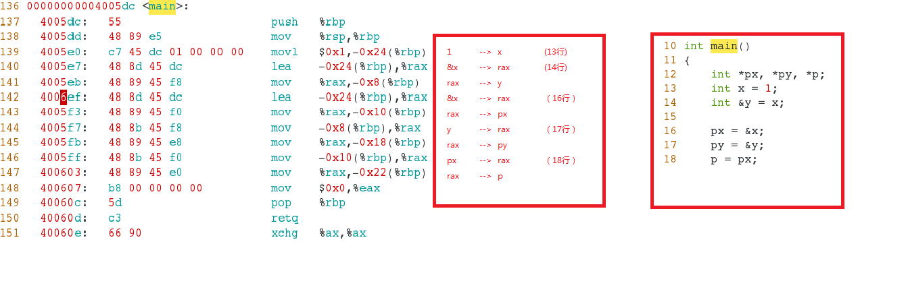
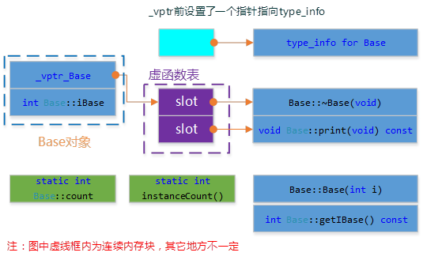

# 


## 1.笔 


### 1.问答题

```cpp
void *memcpy(void *dst, const void *src, size_t len) {
    if(!dst || !src) return NULL;
    void *ret = dst;
    if(dst <= src || (char *)dst >= (char *)src + len) {
    //没有内存重叠，从低地址开始复制
        while(len--) {
            *(char *)dst = *(char *)src;
            dst = (char *)dst + 1;
            src = (char *)src + 1;
        }
    }
    else {
        //有内存重叠，从高地址开始复制
        src = (char *)src + len - 1;
        dst = (char *)dst + len - 1;
        while(len--) {
            *(char *)dst = *(char *)src;
            dst = (char *)dst - 1;
            src = (char *)src - 1;
        }
    }
    return ret;
}
```

复制是从低地址开始复制，内存覆盖的情况:str的地址小于dst的地址，如果str-dst＜＝len, 那么str后半部分就会被覆盖。

### 2.问答题

STL中vector的实现原理 (衍生：Map, Set等实现原理)

vector的数据安排以及操作方式，与array非常相似。两者的唯一区别在于空间的运用的灵活性：   
1. array是静态空间，一旦配置了就不能改变；
2. 要换个大（或小）一点的房子，可以，一切琐细都得由客户端自己来：首先配置一块新空间，然后将元素从旧址一一搬往新址，再把原来的空间释还给系统。

1. vector是动态空间，随着元素的加入，它的内部机制会自行扩充空间以容纳新元素。因此，vector的运用对于内存的合理利用与运用的灵活性有很大的帮助，我们再也不必因为害怕空间不足而一开始要求一个大块头的array了，我们可以安心使用array，吃多少用多少。 

vector的实现技术，关键在于其对大小的控制以及重新配置时的数据移动效率。一旦vector的旧有空间满载，如果客户端每新增一个元素，vector的内部只是扩充一个元素的空间，实为不智。因为所谓扩充空间（不论多大），一如稍早所说，是”  配置新空间/数据移动/释还旧空间  “的大工程，时间成本很高，应该加入某种未雨绸缪的考虑。稍后我们便可看到SGI vector的空间配置策略了。 

另外，由于vector维护的是一个连续线性空间，所以vector支持随机存取。 

注意：vector动态增加大小时，并不是在原空间之后持续新空间（因为无法保证原空间之后尚有可供配置的空间），而是以原大小的两倍另外配置一块较大的空间，然后将原内容拷贝过来，然后才开始在原内容之后构造新元素，并释放原空间。因此，对vector的任何操作，一旦引起空间重新配置，指向原vector的所有迭代器就都失效了。这是程序员易犯的一个错误，务需小心。

1、Vector是顺序容器，是一个动态数组，支持随机存取、插入、删除、查找等操作，在内存中是一块连续的空间。在原有空间不够情况下自动分配空间。vector随机存取效率高，但是在vector插入元素，需要移动的数目多，效率低下。
2、Map是关联容器，以键值对的形式进行存储，方便进行查找。关键词起到索引的作用，值则表示与索引相关联的数据。以红黑树的结构实现，插入删除等操作都在O(logn)时间内完成
3、Set是关联容器，set中每个元素只包含一个关键字。set支持高效的关键字查询操作——检查一个给定的关键字是否在set中。set也是以红黑树的结构实现，支持高效插入、删除等操作。

### 3.问答题

给定N张扑克牌和一个随机函数，设计一个洗牌算法

1. 假定Ｎ=54，首先有能够产生1-54之间随机数的函数发生器；
2. 扑克牌是一个54元素的数组card，我们要做的就是：从card数组中随机取一个元素，然后在剩下的元素里再随机取一个元素，这里涉及到一个问题，就是每次取完元素后，我们就不会让这个元素参与下一次的选取。这样，我们就可以把第一次随机的索引x取的牌`card[x]`与第一个元素互换`card[0]`，第二次随机，在`[1,53]`内进行随机，然后让取出的牌与第二个元素`card[1]`交换……
3. 直到最后一张牌，不需要换，因为就是本身。

```cpp
void RandomShuffle(int a[], int n){ 
    for(int i=0; i<n; ++i){ 
        int j = rand() % (n-i) + i;// 产生i到n-1间的随机数 
        Swap(a[i], a[j]);//交换位置 
    } 
}
```

### 4.问答题

25匹马，5个跑道，每个跑道最多能有1匹马进行比赛，最少比多少次能比出前3名？前5名？

注意： "假设每匹马都跑的很稳定" 的意思是在上一场比赛中A马比B马快，则下一场比赛中A马依然比B马快。
 
稍微想一下，可以采用一种 竞标赛排序(Tournament Sort)的思路。 见《选择排序》
 
(1) 首先将25匹马分成5组，并分别进行5场比赛之后得到的名次排列如下：  
              A组：  [A1  A2  A3  A4  A5]  
              B组：  [B1  B2  B3  B4  B5]  
              C组：  [C1  C2  C3  C4  C5]  
              D组：  [D1  D2  D3  D4  D5]  
              E组：  [E1  E2  E3  E4  E5]  
其中，每个小组最快的马为[A1、B1、C1、D1、E1]。  
(2) 将[A1、B1、C1、D1、E1]进行第6场，选出第1名的马，不妨设 A1>B1>C1>D1>E1. 此时第1名的马为A1。  
(3) 将[A2、B1、C1、D1、E1]进行第7场，此时选择出来的必定是第2名的马，不妨假设为B1。因为这5匹马是除去A1之外每个小组当前最快的马。  
(3) 进行第8场，选择[A2、B2、C1、D1、E1]角逐出第3名的马。    
(4) 依次类推，第9，10场可以分别决出第4，5名的吗。  
 
因此，依照这种竞标赛排序思想，需要10场比赛是一定可以取出前5名的。  
 
 
仔细想一下，如果需要减少比赛场次，就一定需要在某一次比赛中同时决出2个名次，而且每一场比赛之后，有一些不可能进入前5名的马可以提前出局。 当然要做到这一点，就必须小心选择每一场比赛的马匹。我们在上面的方法基础上进一步思考这个问题，希望能够得到解决。  
 
(1) 首先利用5场比赛角逐出每个小组的排名次序是绝对必要的。  
(2) 第6场比赛选出第1名的马也是必不可少的。假如仍然是A1马(A1>B1>C1>D1>E1)。那么此时我们可以得到一个重要的结论：有一些马在前6场比赛之后就决定出局的命运了(下面绿色字体标志出局)。  
       A组：  [A1  A2  A3  A4  A5]  
       B组：  [B1  B2  B3  B4  B5]  
       C组：  [C1  C2  C3  C4  C5]  
       D组：  [D1  D2  D3  D4  D5]  
       E组：  [E1  E2  E3  E4  E5]  
(3) 第7场比赛是关键，能否同时决出第2，3名的马呢？我们首先做下分析：  
     在上面的方法中，第7场比赛[A2、B1、C1、D1、E1]是为了决定第2名的马。但是在第6场比赛中我们已经得到(B1>C1>D1>E1)，试问？有B1在的比赛，C1、D1、E1还有可能争夺第2名吗？ 当然不可能，也就是说第2名只能在A2、B1中出现。实际上只需要2条跑道就可以决出第2名，剩下C1、D1、E1的3条跑道都只能用来凑热闹的吗？  
     能够优化的关键出来了，我们是否能够通过剩下的3个跑道来决出第3名呢？当然可以，我们来进一步分析第3名的情况？  
     ● 如果A2>B1(即第2名为A2)，那么根据第6场比赛中的(B1>C1>D1>E1)。 可以断定第3名只能在A3和B1中产生。  
     ● 如果B1>A2(即第2名为B1)，那么可以断定的第3名只能在A2, B2,C1 中产生。  
     好了，结论也出来了，只要我们把[A2、B1、A3、B2、C1]作为第7场比赛的马，那么这场比赛的第2，3名一定是整个25匹马中的第2，3名。  
     我们在这里列举出第7场的2，3名次的所有可能情况：  
     ①  第2名=A2，第3名=A3  
     ②  第2名=A2，第3名=B1  
     ③  第2名=B1，第3名=A2  
     ④  第2名=B1，第3名=B2  
     ⑤  第2名=B1，第3名=C1  
 
(4)  第8场比赛很复杂，我们要根据第7场的所有可能的比赛情况进行分析。  
      ①  第2名=A2，第3名=A3。那么此种情况下第4名只能在A4和B1中产生。  
           ● 如果第4名=A4，那么第5名只能在A5、B1中产生。  
           ● 如果第4名=B1，那么第5名只能在A4、B2、C1中产生。  
           不管结果如何，此种情况下，第4、5名都可以在第8场比赛中决出。其中比赛马匹为[A4、A5、B1、B2、C1]  
      ②  第2名=A2，第3名=B1。那么此种情况下第4名只能在A3、B2、C1中产生。  
           ● 如果第4名=A3，那么第5名只能在A4、B2、C1中产生。  
           ● 如果第4名=B2，那么第5名只能在A3、B3、C1中产生。  
           ● 如果第4名=C1，那么第5名只能在A3、B2、C2、D1中产生。  
           那么，第4、5名需要在马匹[A3、B2、B3、C1、A4、C2、D1]七匹马中产生，则必须比赛两场才行，也就是到第9场角逐出全部的前5名。  
      ③  第2名=B1，第3名=A2。那么此种情况下第4名只能在A3、B2、C1中产生。  
           情况和②一样，必须角逐第9场  
      ④  第2名=B1，第3名=B2。 那么此种情况下第4名只能在A2、B3、C1中产生。  
           ● 如果第4名=A2，那么第5名只能在A3、B3、C1中产生。  
           ● 如果第4名=B3，那么第5名只能在A2、B4、C1中产生。  
           ● 如果第4名=C1，那么第5名只能在A2、B3、C2、D1中产生。  
            那么，第4、5名需要在马匹[A2、B3、B4、C1、A3、C2、D1]七匹马中产 生，则必须比赛两场才行，也就是到第9场角逐出全部的前5名。  
        ⑤  第2名=B1，第3名=C1。那么此种情况下第4名只能在A2、B2、C2、D1中产生。  
            ● 如果第4名=A2，那么第5名只能在A3、B2、C2、D1中产生。  
            ● 如果第4名=B2，那么第5名只能在A2、B3、C2、D1中产生。  
            ● 如果第4名=C2，那么第5名只能在A2、B2、C3、D1中产生。  
            ● 如果第4名=D1，那么第5名只能在A2、B2、C2、D2、E2中产生。  
             那么，第4、5名需要在马匹[A2、B2、C2、D1、A3、B3、C3、D2、E1]九匹马中 产 生，因此也必须比赛两场，也就是到第9长决出胜负。  
 
总结：最好情况可以在第8场角逐出前5名，最差也可以在第9场搞定。  

参考：【Google】25匹马的角逐 - 爪哇人 - ITeye博客  
http://hxraid.iteye.com/blog/662643

### 5.问答题

100亿个整数，内存足够，如何找到中位数？内存不足，如何找到中位数？

#### 内存足

用类似quick sort的思想，均摊复杂度为O(n)，算法思想如下： 

1. 随机选取一个元素，将比它小的元素放在它左边，比它大的元素放在右边；  
2. 如果它恰好在中位数的位置，那么它就是中位数，可以直接返回；  
3. 如果小于它的数超过一半，那么中位数一定在左半边，递归到左边处理；  
4. 否则，中位数一定在右半边，根据左半边的元素个数计算出中位数是右半边的第几大，然后递归 到右半边处理。  

#### 内存不⾜

方法⼀：⼆分法   
思路：一个重要的线索是，这些数都是整数。整数就有范围了，32位系统中就是`[-2^32, 2^32-1]`，有了范围我们就可以对这个范围进行二分，然后找有多少个数⼩于Mid,多少数大于mid，然后递归，和基于quicksort思想的第k大⽅方法类似  

方法二：分桶法  
思路：化大为小，把所有数划分到各个小区间，把每个数映射到对应的区间⾥里，对每个区间中数的个数进行计数，数一遍各个区间，看看中位数落在哪个区间，若够小，使⽤用基于内存的算法，否则继续划分。

对于分桶，具体来说：

- 题目说是整数，我们认为是带符号的int,所以4字节，占32位。  
- 假设100亿个数字保存在一个大文件中，依次读一部分文件到内存(不超过内存的限制)，将每个数字用二进制表示，比较二进制的最高位(第32位，符号位，0是正，1是负)，如果数字的最高位为0，则将这个数字写入 file_0文件中；如果最高位为 1，则将该数字写入file_1文件中。  
- 从而将100亿个数字分成了两个文件，假设 file_0文件中有 60亿 个数字，file_1文件中有 40亿 个数字。那么中位数就在 file_0 文件中，并且是 file_0 文件中所有数字排序之后的第 10亿 个数字。（file_1中的数都是负数，file_0中的数都是正数，也即这里一共只有40亿个负数，那么排序之后的第50亿个数一定位于file_0中）  
- 现在，我们只需要处理 file_0 文件了（不需要再考虑file_1文件）。对于 file_0 文件，同样采取上面的措施处理：将file_0文件依次读一部分到内存(不超内存限制)，将每个数字用二进制表示，比较二进制的 次高位（第31位），如果数字的次高位为0，写入file_0_0文件中；如果次高位为1，写入file_0_1文件中。  
- 现假设 file_0_0文件中有30亿个数字，file_0_1中也有30亿个数字，则中位数就是：file_0_0文件中的数字从小到大排序之后的第10亿个数字。  
- 抛弃file_0_1文件，继续对 file_0_0文件 根据 次次高位(第30位) 划分，假设此次划分的两个文件为：file_0_0_0中有5亿个数字，file_0_0_1中有25亿个数字，那么中位数就是 file_0_0_1文件中的所有数字排序之后的 第 5亿 个数。  
- 按照上述思路，直到划分的文件可直接加载进内存时，就可以直接对数字进行快速排序，找出中位数了。

## 2.C/C++基础(上)

### 6.问答题

请简述智能指针原理，并实现一个简单的智能指针。

智能指针是一种资源管理类，通过对原始指针进行封装，在资源管理对象进行析构时对指针指向的内存进行释放；通常使用引用计数方式进行管理，一个基本实现如下：

智能指针：实际指行为类似于指针的类对象 ，它的一种通用实现方法是采用引用计数的方法。  
1.智能指针将一个计数器与类指向的对象相关联，引用计数跟踪共有多少个类对象共享同一指针。    
2.每次创建类的新对象时，初始化指针并将引用计数置为1；   
3.当对象作为另一对象的副本而创建时，拷贝构造函数拷贝指针并增加与之相应的引用计数；  
4.对一个对象进行赋值时，赋值操作符减少左操作数所指对象的引用计数（如果引用计数为减至0，则删除对象），并增加右操作数所指对象的引用计数；这是因为左侧的指针指向了右侧指针所指向的对象，因此右指针所指向的对象的引用计数+1；  
5.调用析构函数时，构造函数减少引用计数（如果引用计数减至0，则删除基础对象）。  
6.实现智能指针有两种经典策略：一是引入辅助类，二是使用句柄类。这里主要讲一下引入辅助类的方法  

```cpp
//基础对象类，要做一个对Point类的智能指针  
class Point  
{  
public:  
    Point(int xVal = 0, int yVal = 0):x(xVal),y(yVal) { }  
    int getX() const { return x; }  
    int getY() const { return y; }  
    void setX(int xVal) { x = xVal; }  
    void setY(int yVal) { y = yVal; }  
private:  
    int x,y;
};

//辅助类，该类成员访问权限全部为private，因为不想让用户直接使用该类
class RefPtr {
    friend class SmartPtr; //定义智能指针类为友元，因为智能指针类需要直接操纵辅助类
    RefPtr(Point *ptr):p(ptr), count(1) {}
    ~RefPtr() { delete p; }

    int count; //引用计数
    Point *p;  //基础对象指针
};

//智能指针类
class SmartPtr {
public:
    SmartPtr(Point *ptr):rp(new RefPtr(ptr)) { }            //构造函数
    SmartPtr(const SmartPtr &sp):rp(sp.rp) { ++rp->count; } //复制构造函数
    SmartPtr& operator=(const SmartPtr& rhs) {              //重载赋值操作符
        ++rhs.rp->count;                                    //首先将右操作数引用计数加1，
        if(--rp->count == 0)                                //然后将引用计数减1，可以应对自赋值
            delete rp;
        rp = rhs.rp;
        return *this;
    }
    ~SmartPtr() {             //析构函数
        if(--rp->count == 0)  //当引用计数减为0时，删除辅助类对象指针，从而删除基础对象
            delete rp;
    }
private:
    RefPtr *rp;               //辅助类对象指针
};
```

### 7.问答题

如何处理循环引用问题？

循环引用，一般来说，有头文件循环引用和两个对象的循环引用！

#### 头文件循环引用

该循环引用会造成编译错误，如文件 `a.h`：

```cpp
#include "b.h"
class A {
B b;
//....
}
```

文件 `b.h`：

```cpp
#include "a.h"
class B {
//....
}
```

这样书写的话会造成互相引用，形成死循环，编译时通不过的，但可以使用前置声明解决，改后的文件 `a.h`：  

```cpp
class B;
class A {
 B b;
//....
}
```

文件 `b.h`：  

```cpp
#include "a,h"
class B {
//....
}
```

一起编译这两个类的cpp文件就能编译通过

#### 两个对象的循环引用

多见于智能指针如share_ptr。  
- 如果两个对象A和B都持有对方的强引用，假若A对象需要释放，但是B对象持有强引用，不能释放，B也是如此，这就造成了两个对象的互相等待，永远得不到释放；  
- 我们可以使用weak_ptr，weak_ptr只是获得对象的使用权，没有获得所有权，当对象A强引用B，B弱引用A，当A需要释放时，有余没有其他的对象引用它了，所以能够释放，B对象也没有其他对象引用，也可以释放。

### 8.问答题

请实现一个单例模式的类，要求线程安全

# 单例模式

1. 将默认构造函数和析构函数声明为私有，外部无法创建，无法销毁（只能自己销毁自己）；  
2. 使用一个私有的静态本类类型的指针变量，用来指向该类的唯一实例；  
3. 用一个公有的静态方法来获取该实例，第一次调用该方法时，创建实例并返回（懒汉式），以后调用直接返回；  
4. 用一个公有的静态方法来删除该实例，以保证该实例只会被删除一次。  

单例模式有三种：懒汉式、饿汉式、登记式。这里给出前两种写法。

```cpp
#include <iostream>
using namespace std;

class A {
private:
    A() {}; //构造和析构私有
    ~A() {};
public:
    static A *GetInstance() { // 公有静态方法，可以获取该唯一实例
        if(!m_pInstance) m_pInstance = new A; //（多线程需要加锁）
            return m_pInstance;
        }
    static void DeleteInstance() { // 公有静态方法，可以删除该实例
        if(m_pInstance)
            delete m_pInstance;
        m_pInstance = nullptr;
    }
private:
    static A *m_pInstance; // 私有静态指针变量：指向类的唯一实例
    int count; //其它成员变量
}

A *A::m_pInstance = nullptr; // 懒汉式
// A *A::m_pInstance = new A // 饿汉式

int main() {
    // A a; // 错误，外部无法创建该类对象
    A *pa = A::GetInstance(); //通过调用，类静态成员函数，来获取该对象
    A *pb = A::GetInstance(); //可多次调用
    cout << pa << pb << endl; //地址相同，pa，pb指向同一个对象
    // delete pa; //错误，外部无法直接销毁该类对象
    A::DeleteInstance(); //通过调用，类静态成员函数，来析构类对象;
    return 0;
}
```

### 9.问答题

如何定义一个只能在堆上（栈上）生成对象的类?

在C++中，类的对象建立分为两种：  
1. 静态建立，如`A a`；
2. 动态建立，如`A* ptr=new A`。

这两种方式是有区别的:  
- 静态建立一个类对象，是由编译器为对象在栈空间中分配内存，是通过直接移动栈顶指针，挪出适当的空间，然后在这片内存空间上调用构造函数形成一个栈对象。使用这种方法，直接调用类的构造函数。  
- 动态建立类对象，是使用new运算符将对象建立在堆空间中。这个过程分为两步，第一步是执行operator new()函数，在堆空间中搜索合适的内存并进行分配；第二步是调用构造函数构造对象，初始化这片内存空间。这种方法，间接调用类的构造函数。

那么如何限制类对象只能在堆或者栈上建立呢？下面分别进行讨论。

#### 只能建立在堆上

类对象只能建立在堆上，就是不能静态建立类对象，即不能直接调用类的构造函数。

容易想到将构造函数设为私有。在构造函数私有之后，无法在类外部调用构造函数来构造类对象，只能使用new运算符来建立对象。然而，前面已经说过，new运算符的执行过程分为两步，C++提供new运算符的重载，其实是只允许重载operator new()函数，而operator()函数用于分配内存，无法提供构造功能。因此，这种方法不可以。

当对象建立在栈上面时，是由编译器分配内存空间的，调用构造函数来构造栈对象。当对象使用完后，编译器会调用析构函数来释放栈对象所占的空间。编译器管理了对象的整个生命周期。如果编译器无法调用类的析构函数，情况会是怎样的呢？比如，类的析构函数是私有的，编译器无法调用析构函数来释放内存。所以，编译器在为类对象分配栈空间时，会先检查类的析构函数的访问性，其实不光是析构函数，只要是非静态的函数，编译器都会进行检查。如果类的析构函数是私有的，则编译器不会在栈空间上为类对象分配内存。

因此，将析构函数设为私有，类对象就无法建立在栈上了。代码如下：  
```cpp
class A
{
public:
    A(){}
    void destory(){delete this;}
private:
    ~A(){}
};
```

试着使用`A a;`来建立对象，编译报错，提示析构函数无法访问。这样就只能使用new操作符来建立对象，构造函数是公有的，可以直接调用。类中必须提供一个destory函数，来进行内存空间的释放。类对象使用完成后，必须调用destory函数。
 
上述方法的一个缺点就是，无法解决继承问题。如果A作为其它类的基类，则析构函数通常要设为virtual，然后在子类重写，以实现多态。因此析构函数不能设为private。还好C++提供了第三种访问控制，protected。将析构函数设为protected可以有效解决这个问题，类外无法访问protected成员，子类则可以访问。

另一个问题是，类的使用很不方便，使用new建立对象，却使用destory函数释放对象，而不是使用delete。（使用delete会报错，因为delete对象的指针，会调用对象的析构函数，而析构函数类外不可访问）这种使用方式比较怪异。为了统一，可以将构造函数设为protected，然后提供一个public的static函数来完成构造，这样不使用new，而是使用一个函数来构造，使用一个函数来析构。代码如下，类似于单例模式：

```cpp
class A
{
protected:
    A(){}
    ~A(){}
public:
    static A* create()
    {
        return new A();
    }
    void destory()
    {
        delete this;
    }
};
```

这样，调用create()函数在堆上创建类A对象，调用destory()函数释放内存。


#### 只能建立在栈上

只有使用new运算符，对象才会建立在堆上，因此，只要禁用new运算符就可以实现类对象只能建立在栈上。将`operator new()`设为私有即可。代码如下：

```cpp
class A
{
private:
    void* operator new(size_t t){}     // 注意函数的第一个参数和返回值都是固定的
    void operator delete(void* ptr){} // 重载了new就需要重载delete
public:
    A(){}
    ~A(){}
};
```

参考：
- https://blog.csdn.net/szchtx/article/details/12000867   
- http://blog.csdn.net/g5dsk/article/details/4775144

### 10.问答题

下面的结构体大小分别是多大（假设32位机器）？

```cpp
struct A {
char a;
char b;
char c;
};
 
struct B {
int a;
char b;
short c;
};
 
struct C {
char b;
int a;
short c;
};
 
#pragma pack(2)
struct D {
char b;
int a;
short c;
};
```  
A：对齐值为：1 。大小为：3  
B：对齐值为：4 。 大小为：4+4 = 8（第一个4为int，第二个4为char 和 short ，要空余1个）  
C：对齐值为：4。大小为：4+4+4 = 12（第一个为char ，空余3个，第二个为int ，第三个为char 空余3个）   
D：指定对齐值为：2（使用了#pragma pack(2)） 。大小为2+4+2 = 8。（第一个char，空余1个，第二个为int ，4个，第3个位char，空余1个）。  

### 11.问答题

引用和指针有什么区别？

#### 理解1
引用就是指针，不是什么别名，它会占用内存，和指针的区别在于引用必须被初始化，在使用它的时候编译器会自解引用，所以引用就是自解引用的指针。

```cpp
int a = 1;
int &b = a;    //汇编语言等价于int *b = &a;
cout<<&a<<endl;
cout<<&b<<endl;    //汇编语言等价于cout<<&(*b)<<endl;
```



#### 理解2  

本质：引用是别名，指针是地址，具体的：   
1. 指针可以在运行时改变其所指向的值，引用一旦和某个对象绑定就不再改变   
2. 从内存上看，指针会分配内存区域，而引用不会，它仅仅是一个别名   
3. 在参数传递时，引⽤用会做类型检查，而指针不会   
4. 引用不能为空，指针可以为空  

### 12.问答题

const和define有什么区别？

#### 理解1

const定义的只读变量在程序运行过程中只有一份拷贝(因为它是全局的只读变量，存放在静态区)，而#define定义的宏常量在内存中有若干个拷贝。

#define宏是在预编译阶段进行替换，而const修饰的只读变量是在编译的时候确定其值。    
#define宏没有类型，而const修饰的只读变量具有特定的类型  
```cpp
const int *p;   //p可变，p指向的对象不可变
int const*p;  //p可变，p指向的对象不可变
int *const p;  //p不可变，p指向的对象可变
const int *const p;  //指针p和p指向的对象都不可变
```
总的来说：
- const：有数据类型，编译进行安全检查，可调试   
- define:宏，不考虑数据类型，没有安检，不能调试   

这里有一个记忆和理解的方法：  
先忽略类型名(编译器解析的时候也是忽略类型名)，我们看const离哪个近。"近水楼台先得月"，离谁近就修饰谁。  
判断时忽略括号中的类型   
```cpp
const (int) *p;   //const修饰*p，*p是指针指向的对象，不可变
(int) const *p；  //const修饰*p，*p是指针指向的对象，不可变
(int)*const p;   //const修饰p，p不可变，p指向的对象可变
const (int) *const p;  //前一个const修饰*p，后一个const修饰p，指针p和p指向的对象都不可变
```
#### 理解2

1）const对应编译器；#define对应预处理器  
例如：#define WQQ 3.5；  
编译器将永远看不到WQQ这个符号，因为在源码进入编译之前，这个符号会被预处理器处理掉，于是WQQ这个符号不会加入符号列表。如果涉及到这个常量的代码在编译时报错，就很令人费解。因为报错的是3.5而不是WQQ，再如果这个WQQ不是在自己的头文件中定义的，后果可想而知...  

2)const有类型安全检查，而宏常量则没有  
对后者只能进行字符串替换，替换过程可能会产生意想不到的错误；  

3）某些集成化调试工具可以对const常量进行调试，但是不能对宏常量调试  

4）存储方式不同  
define定义的常量仅仅是展开，有多少地方使用就展开多少次，在替换后运行过程中会不断占用内存；而const定义的常量存储在数据段，只有一份拷贝

# 13.问答题

define和inline有什么区别？

本质：define只是字符串替换，inline由编译器控制，具体的：   
- define只是简单的宏替换，通常会产生二义性；而inline会真正地编译到代码中   
- inline函数是否展开由编译器决定，有时候当函数太大时，编译器可能选择不展开相应的函数  

### 14.问答题

malloc和new有什么区别？

new与malloc的10点区别  
1. 申请的内存所在位置  
2. 返回类型安全性  
3. 内存分配失败时的返回值  
4. 是否需要指定内存大小  
5. 是否调用构造函数/析构函数  
6. 对数组的处理  
7. new与malloc是否可以相互调用  
8. 是否可以被重载  
9. 能够直观地重新分配内存  
10. 客户处理内存分配不足  


参考：[细说new与malloc的10点区别 - melonstreet - 博客园](http://www.cnblogs.com/QG-whz/p/5140930.html)

### 15.问答题

C++中static关键字作用有哪些？

1. 隐藏。当同时编译多个文件时，所有未加static前缀的全局变量和函数都具有全局可见性。static可以用作函数和变量的前缀，对于函数来讲，static的作用仅限于隐藏；  
2. 保持变量内容的持久。存储在静态数据区的变量会在程序刚开始运行时就完成初始化，也是唯一的一次初始化。共有两种变量存储在静态存储区：全局变量和static变量，只不过和全局变量比起来，static可以控制变量的可见范围，说到底static还是用来隐藏的。虽然这种用法不常见；  
3. static的第三个作用是默认初始化为0（static变量）；  
4. C++中的作用：    
4.1 不能将静态（static）成员函数定义为虚函数；  
4.2 静态（static）数据成员是静态存储的，所以必须对它进行初始化（程序员手动初始化，否则编译时一般不会报错，但是在Link时会报错误）；  
4.3 静态（static）数据成员在<定义或说明>时前面加关键字static。

### 16.问答题

C++中const关键字作用有哪些？

1. 定义常量  
    1. const修饰变量，以下两种定义形式在本质上是一样的。它的含义是：const修饰的类型为TYPE的变量value是不可变的。       
    ```cpp
    TYPE const ValueName = value; 
    const TYPE ValueName = value;
    ```
2. 将const改为外部连接，作用于扩大至全局，编译时会分配内存，并且可以不进行初始化，仅仅作为声明，编译器认为在程序其他方进行了定义：  
    ```cpp
    extend const int ValueName = value;
    ```
3. 指针使用const；  
    3.1 指针本身是常量不可变  
    ```cpp
    (char*) const pContent; 
    const (char*) pContent; 
    ```
    3.2 指针所指向的内容是常量不可变  
    ```cpp
    const (char) *pContent; 
    (char) const *pContent;
    ```
    3.3 两者都不可变  
    ```cpp
    const char* const pContent; 
    ```
    3.4 还有其中区别方法：  
    - 如果const位于\*的左侧，则const就是用来修饰指针所指向的变量，即指针指向为常量；  
    - 如果const位于\*的右侧，const就是修饰指针本身，即指针本身是常量。  
4. 函数中使用const  
    4.1 const修饰函数参数  
        a. 传递过来的参数在函数内不可以改变(无意义，因为Var本身就是形参)  
        ```cpp
        void function(const int Var);
        ```
        b. 参数指针所指内容为常量不可变  
        ```cpp
        void function(const char* Var);
        ```
        c. 参数指针本身为常量不可变(也无意义，因为char* Var也是形参)  
        ```cpp
        void function(char* const Var);
        ```
        d. 参数为引用，为了增加效率同时防止修改。修饰引用参数时：  
        ```cpp
        void function(const Class& Var); //引用参数在函数内不可以改变
        void function(const TYPE& Var);  //引用参数在函数内为常量不可变
        ```
        这样的一个const引用传递和最普通的函数按值传递的效果是一模一样的，他禁止对引用的对象的一切修改，唯一不同的是按值传递会先建立一个类对象的副本，然后传递过去，而它直接传递地址，所以这种传递比按值传递更有效。另外只有引用的const传递可以传递一个临时对象，因为临时对象都是const属性，且是不可见的，他短时间存在一个局部域中，所以不能使用指针，只有引用的const传递能够捕捉到这个家伙。  
    4.2 const修饰函数返回值  
    const修饰函数返回值其实用的并不是很多，它的含义和const修饰普通变量以及指针的含义基本相同。  
        a. `const int fun1();  //无意义，参数返回本身就是赋值`   
        b. `const int *fun2(); //调用时 const int *pValue = fun2(); //我们可以把fun2()看作成一个变量，即指针内容不可变`  
        c. `int* const fun3(); //调用时 int * const pValue = fun2();`，我们可以把fun2()看作成一个变量，即指针本身不可变  
    一般情况下，**函数的返回值为某个对象时，如果将其声明为const时，多用于操作符的重载**。通常，不建议用const修饰函数的返回值类型为某个对象或对某个对象引用的情况。原因如下：如果返回值为某个对象为const（`const A test = A `实例）或某个对象的引用为const（`const A& test = A`实例） ，则返回值具有const属性，则返回实例只能访问类A中的公有（保护）数据成员和const成员函数，并且不允许对其进行赋值操作，这在一般情况下很少用到。  
5. 类相关const  
    5.1 const修饰成员变量  
    const修饰类的成员函数，表示成员常量，不能被修改，同时它只能在初始化列表中赋值。  
    ```cpp
    class A { 
        A(int x): nValue(x) { } ; //只能在初始化列表中赋值
        const int nValue;         //成员常量不能被修改
     } 
    ```
    5.2 const修饰成员函数  
    const修饰类的成员函数，则该成员函数不能修改类中任何非const成员函数。一般写在函数的最后来修饰。  
    ```cpp
    class A { 
       void function() const; //常成员函数, 它不改变对象的成员变量也不能调用非const成员函数.
    }
    ```
    对于const类对象/指针/引用，只能调用类的const成员函数，因此，const修饰成员函数的最重要作用就是限制对于const对象的使用。  
        a. const成员函数不被允许修改它所在对象的任何一个数据成员；  
        b. const成员函数能够访问对象的const成员，而其他成员函数不可以。  
    5.3 const修饰类对象/对象指针/对象引用  
        a. const修饰类对象表示该对象为常量对象，其中的任何成员都不能被修改。对于对象指针和对象引用也是一样；  
        b. const修饰的对象，该对象的任何非const成员函数都不能被调用，因为任何非const成员函数会有修改成员变量的企图。  
    例如：  
    ```cpp
    class AAA { 
        void func1(); 
        void func2() const; 
    } 
    
    const AAA aObj; 
    // aObj.func1(); //×
    aObj.func2(); //正确
    const AAA* aObj = new AAA(); 
    //aObj-> func1(); //×
    aObj-> func2(); //正确
    ```
    
# 17.问答题

C++中成员函数能够同时用static和const进行修饰？

不能。C++编译器在实现const的成员函数的时候为了确保该函数不能修改类的中参数的值，会在函数中添加一个隐式的参数const this\*。但当一个成员为static的时候，该函数是没有this指针的。也就是说此时const的用法和static是冲突的。

详细来说，**在定义一个类对象的时候，实际上只给该对象的非静态的数据成员分配内存空间（假设没有虚函数），而该类的静态成员数据以及该类的函数都在编译的时候分配到一个公共的空间里，所以，在定义一个对象并调用类对象的函数的时候，函数根本不知道到底是哪个对象调用了他，怎么解决这个问题呢？ **

C++利用传递this指针的方式来实现，调用一个类对象里的函数的时候，将把这个对象的指针传递给他，以便函数对该对象的数据进行操作，对于一个定义为const的函数，传递的是const的this指针，说明不能更改对象的属性，而对static成员的函数不需传递this指针，所有就不需要用const来修饰static的成员函数了！

const属性的作用就是对被传递的this指针加以限定，而对static成员函数的调用根本不传递this指针，因而不需const来修饰static的成员函数。 

从对象模型上来说：  
- 类的非static成员函数在编译的时候都会扩展加上一个this参数，const的成员函数被要求不能修改this所指向的这个对象；
- 而static函数编译的时候并不扩充加上this参数，自然无所谓const。 

### 18.问答题  

下面三个变量分别代表什么含义？ 

```cpp
const int* ptr; 
int const* ptr; 
int* const ptr;
```

1. 指针指向的变量可以改变，但是值不可以改变。   
2. 指针指向的变量可以改变，但是值不可以改变。   
3. 表示指针不指向其他对象。  

### 19.问答题

C++中包含哪几种强制类型转换？他们有什么区别和联系？

1. reinterpret_cast: 转换一个指针为其它类型的指针。它也允许从一个指针转换为整数类型，反之亦然。这个操作符能够在非相关的类型之间转换。操作结果只是简单的从一个指针到别的指针的值的二进制拷贝。在类型之间指向的内容**不做任何类型的检查和转换**。  
```cpp
class A{}; 
class B{}; 
A* a = new A;
B* b = reinterpret_cast(a); 
```
2. static_cast: 允许执行任意的隐式转换和相反转换动作（即使它是不允许隐式的）。例如：应用到类的指针上，意思是说它允许子类类型的指针转换为父类类型的指针（这是一个有效的隐式转换），同时也能够执行相反动作: 转换父类为它的子类。   
```cpp
class Base {}; 
class Derive:public Base{}; 
Base* a = new Base; 
Derive *b = static_cast(a); 
```
3. dynamic_cast: 只用于对象的指针和引用。当用于多态类型时，它允许任意的隐式类型转换以及相反过程. 不过，与static_cast不同，在后一种情况里（注：即隐式转换的相反过程）,dynamic_cast 会检查操作是否有效. 也就是说, 它会检查转换是否会返回一个被请求的有效的完整对象。检测在运行时进行. 如果被转换的指针不是一个被请求的有效完整的对象指针，返回值为NULL. 对于引用类型，会抛出bad_cast异常。   
4. const_cast: 这个转换类型操纵传递对象的const属性，或者是设置或者是移除。例如：   
```cpp
class C{}; 
const C* a = new C; 
C *b = const_cast(a);
```
更详细：C++中四种强制类型转换的区别-梦醒潇湘love-ChinaUnix博客  
http://blog.chinaunix.net/uid-26548237-id-3954104.html

## 3.C/C++基础(下)

### 20.问答题

下面两段代码的输出分别是什么（答案见代码注释）？
考察对虚函数的基本理解 

先看静态类型，若有对应的非虚函数，则执行；
有对应的虚函数，看真实类型（即派生类）中是否有其虚函数的重载，再执行；

多态的条件：

1. 存在继承关系，基类有虚函数；
2. 派生类中有同名虚函数，并且override基类虚函数；
3. 通过已被子对象赋值的**基类指针或引用**，调用虚函数。


```cpp
class Base{
    public:
        virtual void Print() const{
            cout << "Print in Base" << endl;
        }
};
class Derive::public base{
    public:
        void Print() const{
            cout << "Print in Derive" << endl;
        }
};
void Print(const Base* base){
    base->Print();
}
int main(){
    Base b;
    Derive d;
    Print(&b); // Print in Base
    Print(&d); // Print in Derive
    return 0;
}
```

```cpp
class Base {
    public:
        void Print() const{
            cout << "Print in Base" << endl;
        }
};
class Derive::public base {
    public:
        void Print() const{
            cout << "Print in Derive" << endl;
        }
};
void Print(const Base* base){
    base->Print();
}
int main(){
    Base b;
    Derive d;
    Print(&b) // Print in Base;
    Print(&d) // Print in Base;
    return 0;
}
```

### 21.问答题

简述C++虚函数作用及底层实现原理

虚函数的作用：简单讲即实现多态。

基类定义了虚函数，子类可以重写该函数，当子类重新定义了父类的虚函数后，父类指针根据赋给它的不同的子类指针，动态地调用属于子类的该函数，且这样的函数调用是无法在编译器期间确认的，而是在运行期确认，也叫做迟绑定。

底层实现原理：先来看看C++对象模型



这个模型从结合上面2中模型的特点，并对内存存取和空间进行了优化。在此模型中，non static 数据成员被放置到对象内部，static数据成员， static and nonstatic 函数成员均被放到对象之外。对于虚函数的支持则分两步完成：

1. 每一个class产生一堆指向虚函数的指针，放在表格之中。这个表格称之为虚函数表（virtual table，vtbl）；
2. 每一个对象被添加了一个指针，指向相关的虚函数表vtbl。通常这个指针被称为vptr。vptr的设定（setting）和重置（resetting）都由每一个class的构造函数，析构函数和拷贝赋值运算符自动完成。

另外，虚函数表地址的前面设置了一个指向type_info的指针，RTTI（Run Time Type Identification）运行时类型识别是有编译器在编译器生成的特殊类型信息，包括对象继承关系，对象本身的描述，RTTI是为多态而生成的信息，所以只有具有虚函数的对象在会生成。

### 22.问答题

一个对象访问普通成员函数和虚函数哪个更快？

访问普通成员函数更快。

- 普通成员函数的地址在编译阶段就已确定，因此在访问时直接调用对应地址的函数；  
- 虚函数在调用时，需要首先在虚函数表中寻找虚函数所在地址，因此相比普通成员函数速度要慢一些。
    - 有人测试过，虚函数大约比普通成员函数慢25%；
    - 详细来看：调用虚函数时，首先要找到该对象的地址，然后找到该对象虚函数表指针(VPTR)的位置（为了提高查找速度，通常就是该对象的地址），虚函数表指针也是在运行时才有的（这句话不太确定），所以虚函数地址是运行期确定的，找到VPTR后根据其指向的虚函数函数指针表得到具体需要调用的函数的地址，相比于普通函数，该过程更复杂且慢。
    
### 23.问答题

在什么情况下，析构函数需要是虚函数？

1. 若该类有基类存在的情况下，需要将析构函数声明为虚函数。否则会使得基类无法析构导致内存泄露。
2. 若该类无继承关系的时候，则无需将析构函数声明为虚函数。

### 24.问答题

内联函数、构造函数、静态成员函数可以是虚函数吗？

- 不可以，首先虚函数是针对对象而言，在运行时候才进行动态联编的；  
- 不可以，内联函数是在编译阶段进行展开，内联函数需要在编译阶段展开，而虚函数是运行时动态绑定的，编译时无法展开；另一种说法认为，inline关键字作为提示符告诉编译器此函数作为内联函数希望在编译阶段展开，但是，编译器并不一定要展开。所以可以声明为虚函数；
- 不可以，构造函数无法是虚函数，因为调用虚函数需要虚函数表指针，而在执行构造函数之前是没有虚函数表指针的；
- 不可以，静态成员函数不可以是虚函数。静态函数是属于类的，不属于对象本身，自然无法有自己的虚函数表指针。

### 25.问答题

构造函数中可以调用虚函数吗？

参见《Effective C++》 条款09：绝不在构造函数或析构函数中调用虚函数。
这个链接有电子档：http://blog.csdn.net/hxz_qlh/article/details/14089895

简要结论：  
1. 从语法上讲，调用完全没有问题。  
2. 但是从效果上看，往往不能达到需要的目的。  

Effective 的解释是：  
- 派生类对象构造期间进入基类的构造函数时，对象类型变成了基类类型，而不是派生类类型。  
- 同样，进入基类析构函数时，对象也是基类类型。

所以，虚函数始终仅仅调用基类的虚函数（如果是基类调用虚函数），不能达到多态的效果，所以放在构造函数中是没有意义的，而且往往不能达到本来想要的效果。

### 26.问答题

简述C++中虚继承的作用及底层实现原理？

作用：  
- 为了解决从不同途径继承来的同名的数据成员在内存中有不同的拷贝造成数据不一致问题，将共同基类设置为虚基类。  
- 这时从不同的路径继承过来的同名数据成员在内存中就只有一个拷贝，同一个函数名也只有一个映射。这样不仅就解决了二义性问题，也节省了内存，避免了数据不一致的问题。  

底层实现原理：底层实现原理与编译器相关，一般通过虚基类指针实现，即各对象中只保存一份父类的对象，多继承时通过虚基类指针引用该公共对象，从而避免菱形继承中的二义性问题。


## 4.智力题

### 27.问答题

1000个灯围成一个环，初始状态是熄灭的，按一个灯，它以及它的左右两盏灯的状态会改变，如何让所有灯都亮？

挨个按一遍。思路是每个灯只会被3个位置改变状态，挨个按一遍恰好每个位置被改变了奇数次 状态


## 5.概率题与操作系统题

## 6.面向对象及数据结构设计

### 58.问答题

设计qps (query per sec)函数，用它控制api调用，使得api n毫秒内只能被调用m次?

设计合理即可，下面是一个参考思路： 
1. 维护一个窗口，窗口有左右两个边界。窗口内为从最后一次访问开始向前n毫秒所有的访问；    
2. 当新来一个访问，更新窗口右边界，打新的时间戳。向右移动窗口左边界，将距当前n毫秒外的访问删除；   
3. 统计次数看是否满足<= m次。  若满足说明未达到调用m次的最大限制，否则已达到。  

### 59.问答题

如何设计一个短网址服务系统？

设计合理即可，实现思路：将url哈希到一个唯一的数值，将这个数值转化为一个字符串，另外还需要考虑系统负载等因素。

#### 原理解析

当我们在浏览器里输入 http://t.cn/RlB2PdD 时

1. DNS首先解析获得 http://t.cn 的 IP 地址；  
2. 当 DNS 获得 IP 地址以后（比如：74.125.225.72），会向这个地址发送 HTTP GET 请求，查询短码 RlB2PdD ， http://t.cn 服务器会通过短码 RlB2PdD 获取对应的长 URL；  
3. 请求通过 HTTP 301 转到对应的长 URL https://m.helijia.com 。  

这里有个小的知识点，为什么要用 301 跳转而不是 302 呐？

301 是永久重定向，302 是临时重定向。短地址一经生成就不会变化，所以用 301 是符合 http 语义的。同时对服务器压力也会有一定减少。
但是如果使用了 301，我们就无法统计到短地址被点击的次数了。而这个点击次数是一个非常有意思的大数据分析数据源。能够分析出的东西非常非常多。所以选择302虽然会增加服务器压力，但是我想是一个更好的选择。  
参考：来自知乎 iammutex 的答案https://www.zhihu.com/question/29270034/answer/46446911

#### 算法解析

网上比较流行的算法有两种 自增序列算法、 摘要算法

##### 算法一

自增序列算法，也叫永不重复算法。设置 id 自增，一个 10进制 id 对应一个 62进制的数值，1对1，也就不会出现重复的情况。这个利用的就是低进制转化为高进制时，字符数会减少的特性。

如十进制 10000，对应不同进制的字符表示，2进制最长，62和64进制最短，只有3位数。

短址的长度一般设为 6 位，而每一位是由 [a - z, A - Z, 0 - 9] 总共 62 个字母组成的，所以 6 位的话，总共会有 62^6 ~= 568亿种组合，基本上够用了。

哈哈，这里附上一个进制转换工具 http://tool.lu/hexconvert/ 上图的数据就是用这个工具生成的。

具体的算法实现，自行谷歌。

##### 算法二

1. 将长网址 md5 生成 32 位签名串,分为 4 段, 每段 8 个字节；  
2. 对这四段循环处理, 取 8 个字节, 将他看成 16 进制串与 0x3fffffff(30位1) 与操作, 即超过 30 位的忽略处理；  
3. 这 30 位分成 6 段, 每 5 位的数字作为字母表的索引取得特定字符, 依次进行获得 6 位字符串；  
4. 总的 md5 串可以获得 4 个 6 位串,取里面的任意一个就可作为这个长 url 的短 url 地址。  

这种算法，虽然会生成4个，但是仍然存在重复几率。

##### 两种算法对比

- 第一种算法的好处就是简单好理解，永不重复。但是短码的长度不固定，随着 id 变大从一位长度开始递增。如果非要让短码长度固定也可以就是让 id 从指定的数字开始递增就可以了。百度短网址用的这种算法。上文说的开源短网址项目 YOURLS 也是采用了这种算法。[源码学习](https://github.com/YOURLS/YOURLS/blob/master/includes/functions.php)  
- 第二种算法，存在碰撞（重复）的可能性，虽然几率很小。短码位数是比较固定的。不会从一位长度递增到多位的。据说微博使用的这种算法。

我使用的算法一。有一个不太好的地方就是出现的短码是有序的，可能会不安全。我的处理方式是构造 62 进制的字母不要按顺序排列。因为想实现自定义短码的功能，我又对算法一进行了优化，下文会介绍。

参考：https://hufangyun.com/2017/short-url/

### 60.问答题

如何设计一个网页爬虫系统？

设计合理即可，实现思路：  
- 使用bfs算法进行网站爬取；
- 使用master节点作为控制节点控制worker节点进行网站爬取；  
- 使用分布式队列做任务调度；  
- 使用key-value存储（如redis)做网页判重。

## 7.大数据

### 61.问答题

- 给一个超过100G大小的log file, log中存着IP地址, 设计算法找到出现次数最多的IP地址？  
- 与上题条件相同，如何找到top K的IP？如何直接用Linux系统命令实现？  

Hash分桶法：   
1. 使用Hash分桶法把数据分发到不同文件。将100G文件分成1000份，将每个IP地址映射到相应文件中：file_id = hash(ip) % 1000 。或者直接对行号进行mod；  
2. 各个文件分别统计top K。在每个文件中分别求出最高频的IP；  
3. 合并 Hash分桶法的结果，得到Top K汇总。 

Linux命令，假设top 10，这里给出两种方法：
1. `sort log_file | uniq -c | sort -nr k1,1 | head -10`  
2. `cat logfile | sort -r | uniq | awk NR==排行数`  

其中，`sort log_file | uniq -c`可以统计`log_file`文件中每行先排序，再统计每行出现的次数。

### 62.问答题

给定100亿个整数，设计算法找到只出现一次的整数

- 如果是有符号整数的话，范围为`-2147483648~2147483647`，无符号整数为`0~4294967296`。有符号的使用两个bitset，一个存放正数，一个负数。   
- 每个数使用两个位来判断其出现几次。00表示出现0词，01出现1次，10出现大于一次。  

比如说存放整数100，就将bitset的第`100*2`位设置为+1，当所有数放完之后，对每两位进行测试看其值为多少？若是第i为与i+1为的值为01，则这个整数：`i*2`，在集合中只出现了1次。需要总共用`bitnum=(2^31*2)`个位表示，因为是位，1字节占8位，所以总共有`2^31*2/8`字节，从B到KB到MB，总共需空间为`int[bitnum]`，即512M。

#### 补充: Bloom filter  

Bloom filter 是由 Howard Bloom 在 1970 年提出的二进制向量数据结构，它具有很好的空间和时间效率，被用来检测一个元素是不是集合中的一个成员。

##### 计算方法

如需要判断一个元素是不是在一个集合中，我们通常做法是把所有元素保存下来，然后通过比较知道它是不是在集合内，链表、树都是基于这种思路，当集合内元素个数的变大，我们需要的空间和时间都线性变大，检索速度也越来越慢。

Bloom filter 采用的是哈希函数的方法，将一个元素映射到一个 m 长度的阵列上的一个点，当这个点是 1 时，那么这个元素在集合内，反之则不在集合内。这个方法的缺点就是当检测的元素很多的时候可能有冲突，解决方法就是使用 k 个哈希 函数对应 k 个点，如果所有点都是 1 的话，那么元素在集合内，如果有 0 的话，元素则不在集合内。

##### 优缺点

- Bloom filter 优点就是它的插入和查询时间都是常数，另外它查询元素却不保存元素本身，具有良好的安全性。  
- 它的缺点也是显而易见的，当插入的元素越多，错判“在集合内”的概率就越大了，另外 Bloom filter 也不能删除一个元素，因为多个元素哈希的结果可能在 Bloom filter 结构中占用的是同一个位，如果删除了一个比特位，可能会影响多个元素的检测。

##### 简单例子

下面是一个简单的 Bloom filter 结构，开始时集合内没有元素


当来了一个元素 a，进行判断，这里哈希函数有两个，计算出对应的比特位上为 0 ，即是 a 不在集合内，将 a 添加进去：


之后的元素，要判断是不是在集合内，也是同 a 一样的方法，只有对元素哈希后对应位置上都是 1 才认为这个元素在集合内（虽然这样可能会误判）：


随着元素的插入，Bloom filter 中修改的值变多，出现误判的几率也随之变大，当新来一个元素时，满足其在集合内的条件，即所有对应位都是 1 ，这样就可能有两种情况，一是这个元素就在集合内，没有发生误判；还有一种情况就是发生误判，出现了哈希碰撞，这个元素本不在集合内。


参考：bloom filter_百度百科  
- https://baike.baidu.com/item/bloom%20filter/6630926

### 63.问答题

给两个文件，分别有100亿个整数，我们只有1G内存，如何找到两个文件交集

使用hash函数将第一个文件的所有整数映射到1000个文件中，每个文件有1000万个整数，大约40M内存，
内存可以放下，把1000个文件记为 a1,a2,a3.....a1000,用同样的hash函数映射第二个文件到1000个文件中，这1000个文件记为b1,b2,b3......b1000，由于使用的是相同的hash函数，所以两个文件中一样的数字会被分配到文件下标一致的文件中，分别对a1和b1求交集，a2和b2求交集，ai和bi求交集，最后将结果汇总，即为两个文件的交集

另有人回答：  
1. 其实这个问题考的知识点是分治法（Divide and Conquer），具体做法楼上通过hash切割文件的答案已经给出来了  
2. 使用bitmap的从内存占用方面感觉不太合适，使用分治法的算法内存占用少，大不了我多创建几个进程同时跑，从性能和内存综合来讲还是最优的  

#### 补充：bitmap

来自于《编程珠玑》。

所谓的Bit-map就是用一个bit位来标记某个元素对应的Value，而Key即是该元素。由于采用了Bit为单位来存储数据，因此在存储空间方面，可以大大节省。

假设我们要对0-7内的5个元素(4,7,2,5,3)排序（这里假设这些元素没有重复）。那么我们就可以采用Bit-map的方法来达到排序的目的。要表示8个数，我们就只需要8个Bit（1Bytes）：

- 首先我们开辟1Byte的空间，将这些空间的所有Bit位都置为0；
- 然后遍历这5个元素，首先第一个元素是4，那么就把4对应的位置为1（可以这样操作 p+(i/8)|(0×01<<(i%8))，当然了这里的操作涉及到Big-ending和Little-ending的情况，这里默认为Big-ending）,因为是从零开始的，所以要把第五位置为1；  
- 然后再处理第二个元素7，将第八位置为1,，接着再处理第三个元素，一直到最后处理完所有的元素，将相应的位置为1。  
- 然后我们现在遍历一遍Bit区域，将该位是一的位的编号输出（2，3，4，5，7），这样就达到了排序的目的。  
- 其实就是把计数排序用的统计数组的每个单位缩小成bit级别的布尔数组。

### 64.问答题

1个文件有100亿个int，1G内存，设计算法找到出现次数不超过2次的所有整数?

先hash到多个文件中，每个文件中的整数用位图表示，一个字节就可以表示4个整数。最后把每个文件中不超过两次的整数和在一起就是答案。

每个数用不到4位，用2位表示数出现的次数，即00表示未出现，01表示出现1次，10表示出现两次，11表示两次以上。然后扫描100亿个数，查看位图中对应的位置，如果是00,01,10，则加1变成01,10,11；如果是11，则不变。最后再扫描一遍位图，输出01，10对应的数。

因所有的数均为int，且100亿超过了int的表示范围，那么就设置bitmap的长度为所有int，即2^32长度，又因为每个数占用2位，所以总共所需要的位数为：2^32 * 2 = 8Gbits，1字节=8位，也就相当于1GB空间。

### 65.问答题

给两个文件，分别有100亿个query，我们只有1G内存，如何找到两个文件交集？分别给出精确算法和近似算法?

精确算法：Hash分桶法  
1，将两个文件中的query hash到N个小文件中，并标明query的来源  
2. 在各个小文件中找到重合的query，来源文件，对应行号（也可不记录行号，只记录来源文件，用2位，01表示来自文件B，10表示来自文件A，11表示重合）     
3. 将所有结果遍历一边，得到文件交集，或者是在第二步的时候若为11则记录重复，就不需要再次扫描  

近似算法：BloomFilter

### 66.问答题

如何扩展BloomFilter使得它支持删除元素的操作？

- BloomFilter本来就是拿来处理大量数据的，假设是10亿个int映射到位图，一个位一个计数器，需要慎重选择数据类型吧，否则放不得下计数器；  
- 将Bloomfilter中的每一位扩展为一个计数器，记录有多少个hash函数映射到这一位；删除的时候，只有当“引用计数”变为0时，才真正将该位置0。

### 67.问答题

如何扩展BloomFilter使得它支持计数操作？

- 将Bloomfilter中的每一位扩展为一个计数器，每个输入元素都要把对应位置加1，从而支持计数 操作。计数个数为，所有映射到的位置中计数的最小值；  
- 但这种做法并不完美，如果输入元素k对应的计数位最小值为m，只能说明k出现的次数不大于m。不能说明k出现的次数等于m。

### 68.问答题

给上千个文件，每个文件大小为1K—100M。给n个词，设计算法对每个词找到所有包含它的文件，你只有100K内存

#### 方法1 trie树/字典树

又称单词查找树，Trie树，是一种树形结构，是一种哈希树的变种。典型应用是用于统计，排序和保存大量的字符串（但不仅限于字符串），所以经常被搜索引擎系统用于文本词频统计。它的优点是：利用字符串的公共前缀来减少查询时间，最大限度地减少无谓的字符串比较，查询效率比哈希树高。

3个基本性质：根节点不包含字符，除根节点外每一个节点都只包含一个字符；从根节点到某一节点，路径上经过的字符连接起来，为该节点对应的字符串； 每个节点的所有子节点包含的字符都不相同。

搜索字典项目的方法为：  
(1) 从根结点开始一次搜索；  
(2) 取得要查找关键词的第一个字母，并根据该字母选择对应的子树并转到该子树继续进行检索；  
(3) 在相应的子树上，取得要查找关键词的第二个字母,并进一步选择对应的子树进行检索。  
(4) 迭代过程……  
(5) 在某个结点处，关键词的所有字母已被取出，则读取附在该结点上的信息，即完成查找。  
其他操作类似处理  

应用1：串的快速检索   
- 给出N个单词组成的熟词表，以及一篇全用小写英文书写的文章，请你按最早出现的顺序写出所有不在熟词表中的生词。   
- 在这道题中，我们可以用数组枚举，用哈希，用字典树，先把熟词建一棵树，然后读入文章进行比较，这种方法效率是比较高的。  

应用2：“串”排序  
- 给定N个互不相同的仅由一个单词构成的英文名，让你将他们按字典序从小到大输出  
- 用字典树进行排序，采用数组的方式创建字典树，这棵树的每个结点的所有儿子很显然地按照其字母大小排序。对这棵树进行先序遍历即可。  

应用3：最长公共前缀  
- 对所有串建立字典树，对于两个串的最长公共前缀的长度即他们所在的结点的公共祖先个数，于是，问题就转化为当时公共祖先问题。  

#### 方法2 布隆过滤器

1. 用一个文件info 准备用来保存ｎ个词和包含其的文件信息；  
2. 首先把ｎ个词分成ｘ份。对每一份用生成一个布隆过滤器（因为对ｎ个词只生成一个布隆过滤器，内存可能不够用）。把生成的所有布隆过滤器存入外存的一个文件Filter中；  
3. 将内存分为两块缓冲区，一块用于每次读入一个布隆过滤器，一个用于读文件(读文件这个缓冲区使用相当于有界生产者消费者问题模型来实现同步)，大文件可以分为更小的文件，但需要存储大文件的标示信息（如这个小文件是哪个大文件的）；  
4. 对读入的每一个单词用内存中的布隆过滤器来判断是否包含这个值，如果不包含，从Filter文件中读取下一个布隆过滤器到内存，直到包含或遍历完所有布隆过滤器。如果包含,更新info 文件。直到处理完所有数据。删除Filter文件。

备注：
１：关于布隆过滤器：其实就是一张用来存储字符串hash值的BitMap.
２：可能还有一些细节问题，如重复的字符串导致的重复计算等要考虑一下。

### 69.问答题

有一个词典，包含N个英文单词，现在任意给一个字符串，设计算法找出包含这个字符串的所有英文单词

论坛里的三种方法  
1. ac自动机；  
2. 倒排索引。给输入字符串，利用字母建立倒排索引，索引中存储该字母 出现在哪个单词以及在单词中位置；查询时，利用倒排找到所有的单词，并求交集并且位置要连续；  
3. key-value。key是单词的字典顺序排序，value是含有这些字母的单词，对于给定字符串str，先进行字典排序，然后找到对应的value就可以了。貌似时间复杂度和空间复杂度不太好。  

我的方法  
0. 问题可以转化为，对于任意一个字符串，如果该字符串的所有词均在字典中，则返回true否则false。  
1. 初始化字典：把字典所有词哈希到一个表，把词作为key，value表示出现次数，得到字典哈希表；
2. 遍历字符串：对字符串中的每个单词哈希，看是否在字典哈希表的key集合中，若存在，则下一个，直到到字符串最后一个词，则返回true，若有某个不在词典哈希表中，则返回false。

